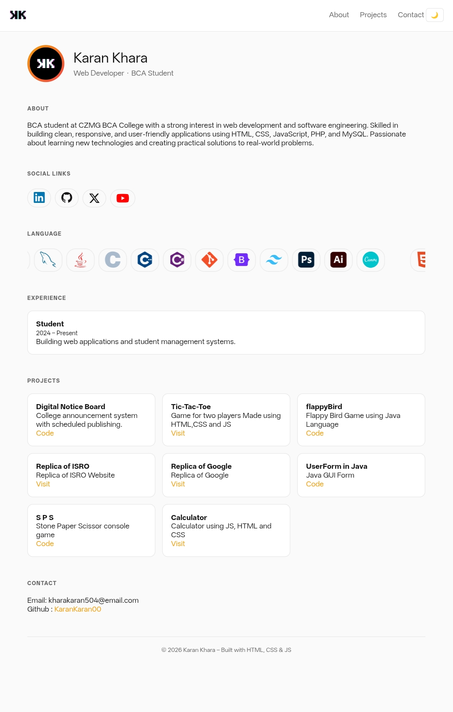
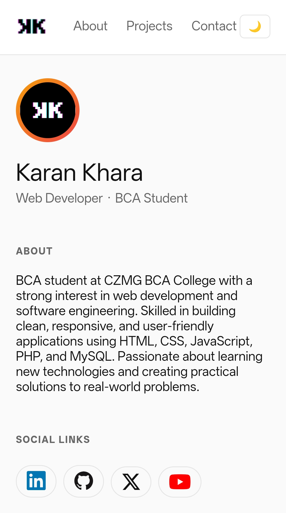

# Portfolio

 https://karankaran00.github.io/Portfolio/
 
# Personal Portfolio Website

This is my personal portfolio website where I showcase my web development projects, skills, and contact information.

## Features
- Responsive design
- Dark and light mode
- Smooth scrolling
- Project showcase
- Contact section

## Technologies Used
- HTML
- CSS
- JavaScript

## How to Run
Clone the repository and open index.html in your browser.

  
    

